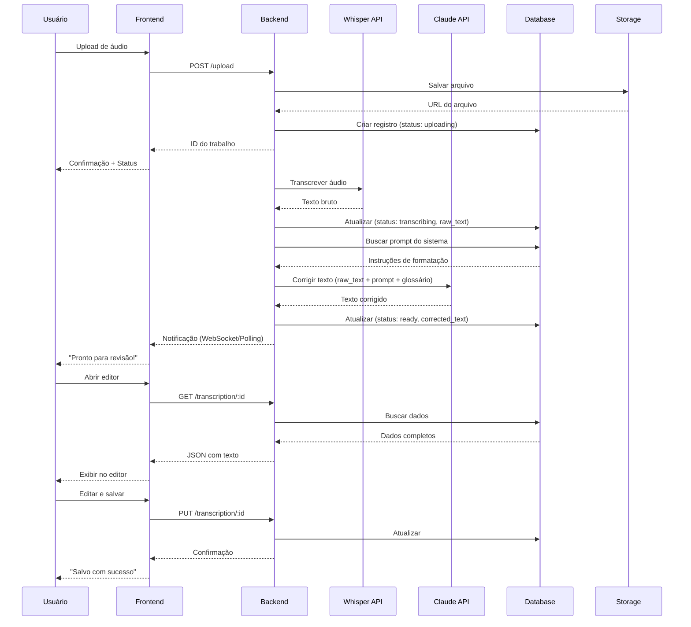

# 📋 ESPECIFICAÇÕES TÉCNICAS - STENOPRO

**Versão:** 1.0  
**Data:** 13/11/2025  
**Autor:** Fernando Silva  
**Status:** Em Desenvolvimento

---

## 1. VISÃO GERAL

### 1.1 Objetivo do Projeto

Sistema web para automatizar o processo de transcrição e revisão de debates parlamentares da Câmara dos Deputados, reduzindo o tempo de processamento de 15-20 minutos para 3-5 minutos por transcrição.

### 1.2 Escopo

**Funcionalidades Principais:**
- Upload de áudios/vídeos de debates parlamentares
- Transcrição automática via API
- Correção e formatação via IA seguindo normas da Câmara dos Deputados
- Editor rich text para revisão manual
- Sistema de glossário para nomes e cargos
- Histórico de trabalhos com busca e filtros
- Exportação em formato compatível com sistema interno

**Fora do Escopo (V1):**
- Colaboração multiusuário em tempo real
- Integração direta com sistemas internos da Câmara
- Aplicativo mobile
- Transcrição ao vivo (streaming)

### 1.3 Usuários

**Primário:** Fernando Silva (Analista de Registro e Redação)  
**Secundário:** Outros analistas da Câmara dos Deputados (futura expansão)

### 1.4 Métricas de Sucesso

- Redução de 70%+ no tempo de processamento por transcrição
- Taxa de acurácia >95% após correção por IA
- Menos de 5 minutos de revisão manual por trabalho
- ROI positivo em 2 meses de uso

---

## 2. ARQUITETURA DO SISTEMA

### 2.1 Stack Tecnológica

#### Frontend
```
- Framework: React 19
- Build Tool: Vite
- Linguagem: TypeScript
- Estilização: Tailwind CSS
- State Management: Zustand
- Data Fetching: React Query (TanStack Query)
- Editor: TipTap (rich text)
- Roteamento: React Router v6
```

#### Backend
```
- Runtime: Node.js 20+
- Framework: Express
- API Layer: tRPC
- ORM: Drizzle ORM
- Database: MySQL 8.0
- Validação: Zod
- Autenticação: JWT
```

#### APIs Externas
```
- Transcrição: OpenAI Whisper API
- IA de Correção: Anthropic Claude API (Sonnet 4.5)
- Storage: AWS S3 ou Railway Storage
```

#### Infraestrutura
```
- Hospedagem: Railway
- CI/CD: GitHub Actions (opcional)
- Monitoramento: Railway Logs
```

### 2.2 Diagrama de Arquitetura

```
┌─────────────────────────────────────────────────────────┐
│                    FRONTEND (React)                      │
│  ┌──────────────┐  ┌──────────────┐  ┌──────────────┐  │
│  │   Upload     │  │    Editor    │  │   Histórico  │  │
│  │   Component  │  │   TipTap     │  │   Component  │  │
│  └──────────────┘  └──────────────┘  └──────────────┘  │
│                                                          │
│                    ↕ tRPC (Type-safe)                   │
└─────────────────────────────────────────────────────────┘
                              ↕
┌─────────────────────────────────────────────────────────┐
│                    BACKEND (Express + tRPC)              │
│  ┌──────────────┐  ┌──────────────┐  ┌──────────────┐  │
│  │   Upload     │  │  Processing  │  │   Storage    │  │
│  │   Handler    │  │  Queue       │  │   Manager    │  │
│  └──────────────┘  └──────────────┘  └──────────────┘  │
│                                                          │
│         ↕                    ↕                  ↕        │
│    [Whisper API]      [Claude API]        [S3/Railway]  │
│                                                          │
│                    ↕ Drizzle ORM                        │
└─────────────────────────────────────────────────────────┘
                              ↕
┌─────────────────────────────────────────────────────────┐
│                   DATABASE (MySQL)                       │
│  ┌──────────────────────────────────────────────────┐   │
│  │  transcriptions │ glossaries │ system_prompts    │   │
│  │  users │ transcription_versions │ settings       │   │
│  └──────────────────────────────────────────────────┘   │
└─────────────────────────────────────────────────────────┘
```

### 2.3 Fluxo de Dados



---

## 3. MODELO DE DADOS

### 3.1 Diagrama Entidade-Relacionamento

```
┌─────────────────────┐
│     users           │
├─────────────────────┤
│ id (PK)             │
│ email               │
│ name                │
│ password_hash       │
│ created_at          │
└─────────────────────┘
          │
          │ 1:N
          ↓
┌─────────────────────┐         ┌─────────────────────┐
│  transcriptions     │────────>│   glossaries        │
├─────────────────────┤  1:N    ├─────────────────────┤
│ id (PK)             │         │ id (PK)             │
│ user_id (FK)        │         │ transcription_id(FK)│
│ title               │         │ name                │
│ room                │         │ info                │
│ audio_url           │         │ created_at          │
│ raw_text            │         └─────────────────────┘
│ corrected_text      │
│ final_text          │         ┌─────────────────────┐
│ status              │────────>│ transcription_vers. │
│ duration_seconds    │  1:N    ├─────────────────────┤
│ created_at          │         │ id (PK)             │
│ updated_at          │         │ transcription_id(FK)│
└─────────────────────┘         │ version             │
                                 │ text                │
                                 │ created_at          │
                                 └─────────────────────┘

┌─────────────────────┐
│  system_prompts     │
├─────────────────────┤
│ id (PK)             │
│ version             │
│ content             │
│ is_active           │
│ created_at          │
└─────────────────────┘
```

### 3.2 Definições das Tabelas

#### 3.2.1 Tabela: users

```sql
CREATE TABLE users (
  id INT PRIMARY KEY AUTO_INCREMENT,
  email VARCHAR(255) UNIQUE NOT NULL,
  name VARCHAR(255) NOT NULL,
  password_hash VARCHAR(255) NOT NULL,
  role ENUM('admin', 'analyst') DEFAULT 'analyst',
  created_at TIMESTAMP DEFAULT CURRENT_TIMESTAMP,
  updated_at TIMESTAMP DEFAULT CURRENT_TIMESTAMP ON UPDATE CURRENT_TIMESTAMP,
  INDEX idx_email (email)
);
```

**Descrição:** Armazena usuários do sistema (futura autenticação multiusuário)

#### 3.2.2 Tabela: transcriptions

```sql
CREATE TABLE transcriptions (
  id INT PRIMARY KEY AUTO_INCREMENT,
  user_id INT NOT NULL,
  title VARCHAR(255) NOT NULL,
  room VARCHAR(100),
  audio_url VARCHAR(512) NOT NULL,
  audio_filename VARCHAR(255) NOT NULL,
  duration_seconds INT,
  raw_text LONGTEXT,
  corrected_text LONGTEXT,
  final_text LONGTEXT,
  status ENUM(
    'uploading',
    'transcribing', 
    'correcting',
    'ready',
    'archived',
    'error'
  ) DEFAULT 'uploading',
  error_message TEXT,
  processing_started_at TIMESTAMP NULL,
  processing_completed_at TIMESTAMP NULL,
  created_at TIMESTAMP DEFAULT CURRENT_TIMESTAMP,
  updated_at TIMESTAMP DEFAULT CURRENT_TIMESTAMP ON UPDATE CURRENT_TIMESTAMP,
  FOREIGN KEY (user_id) REFERENCES users(id) ON DELETE CASCADE,
  INDEX idx_user_id (user_id),
  INDEX idx_status (status),
  INDEX idx_created_at (created_at),
  INDEX idx_room (room)
);
```

**Descrição:** Tabela principal que armazena todos os trabalhos de transcrição

**Estados possíveis:**
- `uploading`: Arquivo sendo enviado
- `transcribing`: Sendo processado pelo Whisper
- `correcting`: Sendo corrigido pelo Claude
- `ready`: Pronto para revisão/uso
- `archived`: Arquivado (não aparece na lista principal)
- `error`: Erro no processamento

#### 3.2.3 Tabela: glossaries

```sql
CREATE TABLE glossaries (
  id INT PRIMARY KEY AUTO_INCREMENT,
  transcription_id INT,
  name VARCHAR(255) NOT NULL,
  info VARCHAR(255),
  is_global BOOLEAN DEFAULT FALSE,
  created_at TIMESTAMP DEFAULT CURRENT_TIMESTAMP,
  FOREIGN KEY (transcription_id) REFERENCES transcriptions(id) ON DELETE CASCADE,
  INDEX idx_transcription_id (transcription_id),
  INDEX idx_is_global (is_global)
);
```

**Descrição:** Glossário de nomes e cargos (pode ser por trabalho ou global)

**Campos:**
- `name`: Nome completo (ex: "Alberto Fraga")
- `info`: Cargo/Partido (ex: "PL-DF")
- `is_global`: Se TRUE, aparece em todos os trabalhos

#### 3.2.4 Tabela: system_prompts

```sql
CREATE TABLE system_prompts (
  id INT PRIMARY KEY AUTO_INCREMENT,
  version INT NOT NULL,
  content TEXT NOT NULL,
  is_active BOOLEAN DEFAULT FALSE,
  created_by INT,
  created_at TIMESTAMP DEFAULT CURRENT_TIMESTAMP,
  FOREIGN KEY (created_by) REFERENCES users(id) ON DELETE SET NULL,
  INDEX idx_is_active (is_active),
  INDEX idx_version (version)
);
```

**Descrição:** Armazena versões do prompt de correção (editável pelo usuário)

**Lógica:**
- Apenas um registro pode ter `is_active = TRUE`
- Ao ativar um novo, os outros são desativados automaticamente
- Mantém histórico de versões

#### 3.2.5 Tabela: transcription_versions

```sql
CREATE TABLE transcription_versions (
  id INT PRIMARY KEY AUTO_INCREMENT,
  transcription_id INT NOT NULL,
  version INT NOT NULL,
  text LONGTEXT NOT NULL,
  created_at TIMESTAMP DEFAULT CURRENT_TIMESTAMP,
  FOREIGN KEY (transcription_id) REFERENCES transcriptions(id) ON DELETE CASCADE,
  INDEX idx_transcription_id (transcription_id),
  UNIQUE KEY unique_version (transcription_id, version)
);
```

**Descrição:** Versionamento de texto (opcional, para histórico de edições)

---

## 4. API ENDPOINTS

### 4.1 Autenticação (Futura)

```typescript
POST /api/auth/register
POST /api/auth/login
POST /api/auth/logout
GET  /api/auth/me
```

### 4.2 Transcrições

```typescript
// Listar trabalhos
GET /api/transcriptions
  Query params: 
    - status?: string
    - room?: string
    - search?: string
    - page?: number
    - limit?: number

// Criar novo trabalho (upload)
POST /api/transcriptions
  Body: FormData {
    audio: File
    title: string
    room?: string
    glossary?: Array<{name: string, info: string}>
  }

// Buscar trabalho específico
GET /api/transcriptions/:id

// Atualizar texto final (após edição)
PUT /api/transcriptions/:id
  Body: {
    final_text: string
  }

// Deletar trabalho
DELETE /api/transcriptions/:id

// Exportar como DOCX
GET /api/transcriptions/:id/export
  Response: application/vnd.openxmlformats-officedocument.wordprocessingml.document

// Reprocessar (caso tenha dado erro)
POST /api/transcriptions/:id/reprocess
```

### 4.3 Glossário

```typescript
// Listar glossário global
GET /api/glossary

// Adicionar ao glossário global
POST /api/glossary
  Body: {
    name: string
    info: string
  }

// Importar CSV
POST /api/glossary/import
  Body: FormData {
    file: File (CSV)
  }

// Deletar do glossário
DELETE /api/glossary/:id
```

### 4.4 Configurações de Prompt

```typescript
// Buscar prompt ativo
GET /api/prompts/active

// Listar todas as versões
GET /api/prompts

// Criar nova versão
POST /api/prompts
  Body: {
    content: string
  }

// Ativar versão específica
PUT /api/prompts/:id/activate
```

### 4.5 Status de Processamento (WebSocket ou Polling)

```typescript
// Opção 1: WebSocket
WS /api/transcriptions/:id/status

// Opção 2: Polling (mais simples para MVP)
GET /api/transcriptions/:id/status
  Response: {
    status: string
    progress?: number (0-100)
    message?: string
  }
```

---

## 5. FUNCIONALIDADES DETALHADAS

### 5.1 Upload e Processamento

**Requisitos:**
- Suporte a formatos: MP3, WAV, M4A, OGG, MP4 (áudio extraído)
- Tamanho máximo: 100MB por arquivo
- Validação de tipo MIME no backend
- Progress bar durante upload
- Preview do arquivo (nome, tamanho, duração estimada)

**Fluxo:**
1. Usuário seleciona arquivo (drag-and-drop ou file picker)
2. Validação no frontend (tipo, tamanho)
3. Upload com progress bar
4. Arquivo salvo no storage
5. Registro criado no banco (status: uploading)
6. Job em background inicia processamento
7. Status atualizado em tempo real

**Tratamento de Erros:**
- Arquivo muito grande: mensagem clara + sugestão de compressão
- Formato inválido: lista de formatos aceitos
- Falha no upload: retry automático (até 3x)
- Erro na transcrição/correção: opção de reprocessar

### 5.2 Transcrição (Whisper API)

**Configuração:**
```typescript
const whisperConfig = {
  model: 'whisper-1',
  language: 'pt', // Português
  response_format: 'verbose_json', // Inclui timestamps
  temperature: 0.0, // Mais determinístico
};
```

**Pós-processamento:**
- Remover timestamps se não necessários
- Limpar caracteres especiais problemáticos
- Detectar pausas longas (possíveis trocas de orador)

### 5.3 Correção via Claude API

**Prompt Base (editável):**
```
✅ INSTRUÇÕES DE REVISÃO E EDIÇÃO TEXTUAL

1. Correção Gramatical com Fidelidade
* Corrigir somente o necessário para garantir correção gramatical e fluidez textual
* Evitar alterações de estilo, mesmo que o termo esteja correto mas diferente do usual do orador
* Jamais trocar o certo pelo certo
* Respeitar a oralidade do orador

2. Formato das Transcrições
* Sempre usar o formato de nota taquigráfica
* Parágrafos bem divididos de acordo com o assunto
* Usar CAIXA ALTA para o nome do orador, seguido do cargo em negrito
* Exemplo: O SR. PRESIDENTE (Alberto Fraga. PL-DF) - Muito obrigado.

[... resto das instruções ...]

# TRANSCRIÇÃO BRUTA:
{raw_text}

# GLOSSÁRIO (consultar para grafia correta):
{glossary}

# TAREFA:
Revise e corrija o texto acima seguindo RIGOROSAMENTE as instruções.
Retorne APENAS o texto formatado, sem comentários adicionais.
```

**Configuração da API:**
```typescript
const claudeConfig = {
  model: 'claude-sonnet-4-5-20250929',
  max_tokens: 16000,
  temperature: 0.1, // Baixa criatividade
};
```

### 5.4 Editor Rich Text (TipTap)

**Extensões Necessárias:**
- StarterKit (básico)
- Bold, Italic
- Paragraph
- Heading (para estrutura)
- Custom: OfficialName (CAIXA ALTA + negrito automático)
- Custom: PartyTag (formatação de partido)
- Custom: StageDirection (itálico para (Palmas.), (Risos.))

**Atalhos de Teclado:**
```
Ctrl+B: Negrito
Ctrl+I: Itálico
Ctrl+Shift+C: Copiar tudo
Ctrl+S: Salvar
Ctrl+E: Exportar
```

**Funcionalidades:**
- Autosave a cada 30 segundos
- Indicador de "salvando..." / "salvo"
- Botão "Copiar para Clipboard"
- Botão "Exportar como DOCX"
- Contador de palavras/caracteres (opcional)

### 5.5 Glossário Dinâmico

**Tipos de Glossário:**

1. **Global:** Nomes recorrentes (deputados conhecidos, ministros, etc.)
2. **Por Trabalho:** Convidados específicos de uma reunião

**Interface de Gerenciamento:**
```
┌──────────────────────────────────────┐
│ 📋 Glossário                         │
├──────────────────────────────────────┤
│                                      │
│ [🌐 Global] [📄 Deste Trabalho]     │
│                                      │
│ Nome                | Cargo/Partido  │
│ ───────────────────|─────────────── │
│ Alberto Fraga      | PL-DF      [✏️][🗑️]│
│ Reinaldo Monteiro  | Pres. AGM  [✏️][🗑️]│
│                                      │
│ [+ Adicionar] [📤 Importar CSV]     │
└──────────────────────────────────────┘
```

**Importação CSV:**
Formato esperado:
```csv
nome,info
Alberto Fraga,PL-DF
Reinaldo Monteiro da Silva,Presidente da AGM Brasil
Rejane Soldani,Guarda Municipal
```

### 5.6 Histórico e Busca

**Filtros Disponíveis:**
- Status (todos, prontos, em processamento, arquivados)
- Quarto (dropdown com quartos únicos)
- Data (intervalo: de/até)
- Busca livre (título, nome de orador no texto)

**Ordenação:**
- Data de criação (padrão: mais recentes primeiro)
- Título (A-Z)
- Quarto
- Status

**Ações em Lote:**
- Arquivar selecionados
- Exportar múltiplos como ZIP
- Deletar selecionados (com confirmação)

### 5.7 Exportação DOCX

**Biblioteca:** `docx` (npm)

**Formatação:**
- Fonte: Arial 12pt
- Parágrafos: espaçamento 1.15
- Oradores: CAIXA ALTA + Negrito
- Partido: entre parênteses, normal
- Anotações como (Palmas.): Itálico
- Margens: 2.5cm (padrão Word)

**Metadados do documento:**
```typescript
{
  creator: "StenoPro",
  title: transcription.title,
  description: `Transcrição - ${transcription.room}`,
  created: transcription.created_at,
}
```

---

## 6. SEGURANÇA

### 6.1 Autenticação (Futura V2)

- JWT tokens com refresh
- Expiração: 24h (access) / 7 dias (refresh)
- HttpOnly cookies
- CORS configurado

### 6.2 Autorização

**Regras:**
- Usuário só vê seus próprios trabalhos
- Admin pode ver todos
- Upload limitado por usuário (rate limiting)

### 6.3 Validação de Entrada

- Zod schemas em todas as rotas
- Sanitização de nomes de arquivo
- Validação de MIME types
- Limite de tamanho de arquivo

### 6.4 Proteção de APIs Externas

- API keys em variáveis de ambiente
- Retry logic com backoff exponencial
- Timeouts configurados
- Logs de erros (sem expor keys)

---

## 7. PERFORMANCE

### 7.1 Otimizações Frontend

- Code splitting por rota
- Lazy loading de componentes pesados (editor)
- Debounce em buscas (300ms)
- React Query cache (5 minutos)
- Memoização de componentes estáticos

### 7.2 Otimizações Backend

- Índices em colunas de busca frequente
- Paginação em listagens (20 por página)
- Compressão de responses (gzip)
- Connection pooling no banco
- Jobs em background (não bloqueantes)

### 7.3 Storage

- Compressão de áudio antes de salvar (opcional)
- CDN para servir áudios (se S3)
- Limpeza automática de arquivos temporários
- Lifecycle policy: deletar após 90 dias (opcional)

---

## 8. MONITORAMENTO E LOGS

### 8.1 Logs Estruturados

```typescript
logger.info('Transcrição iniciada', {
  transcriptionId: id,
  userId: user.id,
  audioSize: file.size,
  duration: metadata.duration,
});

logger.error('Erro na transcrição', {
  transcriptionId: id,
  error: error.message,
  stack: error.stack,
  provider: 'whisper',
});
```

### 8.2 Métricas

- Tempo médio de processamento
- Taxa de sucesso/erro por etapa
- Custo de API por transcrição
- Volume de transcrições por dia/mês

### 8.3 Alertas

- Erro em >10% das transcrições (1h)
- Custo de API >R$50/dia
- Tempo de processamento >10min
- Storage >80% da quota

---

## 9. ESTIMATIVAS

### 9.1 Custos Operacionais Mensais

**APIs:**
- Whisper: 500 min × $0.006 = $3.00
- Claude: 100 transcrições × ~$0.15 = $15.00
- **Subtotal APIs: ~$18/mês (R$90)**

**Infraestrutura:**
- Railway (1GB RAM, 1vCPU): $5/mês
- Storage (10GB): $3/mês
- **Subtotal Infra: ~$8/mês (R$40)**

**Total estimado: R$120-150/mês**

### 9.2 Tempo de Desenvolvimento

**MVP (Funcional):** 2-3 semanas
- Setup projeto: 1 dia
- Backend + APIs: 5 dias
- Frontend básico: 5 dias
- Integrações: 3 dias
- Testes: 2 dias

**V1 (Polido):** +1-2 semanas
- Refinamento de UX
- Sistema de prompts editável
- Glossário completo
- Exportação DOCX
- Correção de bugs

**Total: 4-5 semanas para V1 completa**

### 9.3 Complexidade por Módulo

| Módulo | Complexidade | Tempo Estimado |
|--------|--------------|----------------|
| Upload de áudio | ⭐⭐ Baixa | 1 dia |
| Integração Whisper | ⭐⭐ Baixa | 1 dia |
| Integração Claude | ⭐⭐⭐ Média | 2 dias |
| Editor TipTap | ⭐⭐⭐⭐ Alta | 3 dias |
| Glossário | ⭐⭐ Baixa | 1 dia |
| Histórico/Busca | ⭐⭐⭐ Média | 2 dias |
| Exportação DOCX | ⭐⭐⭐ Média | 2 dias |
| Sistema de prompts | ⭐⭐ Baixa | 1 dia |
| Background jobs | ⭐⭐⭐ Média | 2 dias |

---

## 10. ROADMAP

### Versão 1.0 (MVP) - Semanas 1-3
- ✅ Upload de áudio
- ✅ Transcrição via Whisper
- ✅ Correção via Claude
- ✅ Editor básico (TipTap)
- ✅ Histórico simples
- ✅ Exportar texto

### Versão 1.1 - Semana 4
- ✅ Sistema de prompts editável
- ✅ Glossário básico
- ✅ Exportação DOCX com formatação
- ✅ Busca e filtros

### Versão 1.2 - Semana 5
- ✅ Glossário global + por trabalho
- ✅ Importação CSV
- ✅ Versionamento de texto
- ✅ Melhorias de UX

### Versão 2.0 (Futuro)
- 🔲 Autenticação multiusuário
- 🔲 Sistema de "quartos" (agrupamento)
- 🔲 Colaboração em tempo real
- 🔲 Dashboard de métricas
- 🔲 API pública (para integração)
- 🔲 Transcrição ao vivo (streaming)

---

## 11. RISCOS E MITIGAÇÕES

| Risco | Probabilidade | Impacto | Mitigação |
|-------|---------------|---------|-----------|
| Whisper errar nomes próprios | Alta | Médio | Glossário + correção Claude |
| Claude não seguir formato exato | Média | Alto | Prompt engineering iterativo + exemplos |
| Latência alta no processamento | Baixa | Médio | Jobs assíncronos + notificações |
| Custo de API acima do esperado | Baixa | Médio | Monitoramento + alertas + cache |
| Problemas de encoding de texto | Média | Baixo | Validação UTF-8 + testes |
| Storage insuficiente | Baixa | Baixo | Limpeza automática + monitoramento |

---

## 12. REQUISITOS NÃO-FUNCIONAIS

### 12.1 Performance
- Tempo de resposta da API: <500ms (exceto processamento)
- Upload: aceitar até 100MB sem timeout
- Editor: sem lag perceptível até 50 páginas de texto

### 12.2 Disponibilidade
- Uptime: >99% (Railway SLA)
- Backup de banco: diário (Railway automático)
- Recovery time: <1h em caso de falha

### 12.3 Usabilidade
- Tempo de aprendizado: <15 minutos
- Interface responsiva (desktop: 1280px+)
- Feedback visual em todas as ações
- Mensagens de erro claras e acionáveis

### 12.4 Manutenibilidade
- Código TypeScript (100% typed)
- Testes unitários em lógica crítica
- Documentação inline em funções complexas
- Git flow com PRs (se colaborativo)

### 12.5 Escalabilidade
- Suporte inicial: 1 usuário
- Suporte futuro: 10-20 usuários simultâneos
- Banco: suporta 10.000+ transcrições sem degradação
- Storage: configurável (fácil migração S3 → outro)

---

## 13. GLOSSÁRIO DE TERMOS

| Termo | Definição |
|-------|-----------|
| **Transcrição** | Processo de converter áudio em texto |
| **Degravação** | Sinônimo de transcrição (termo usado na Câmara) |
| **Nota Taquigráfica** | Formato padrão de transcrição parlamentar |
| **Quarto** | Equipe/setor responsável pela transcrição |
| **Orador** | Pessoa que está falando no debate |
| **Glossário** | Lista de nomes e cargos para referência |
| **Raw Text** | Texto bruto saído do Whisper (sem correção) |
| **Corrected Text** | Texto após processamento do Claude |
| **Final Text** | Texto após revisão manual do usuário |

---

## 14. REFERÊNCIAS

- [OpenAI Whisper API](https://platform.openai.com/docs/guides/speech-to-text)
- [Anthropic Claude API](https://docs.anthropic.com/claude/reference/messages)
- [TipTap Editor](https://tiptap.dev/)
- [Drizzle ORM](https://orm.drizzle.team/)
- [tRPC](https://trpc.io/)
- [Railway Docs](https://docs.railway.app/)

---

## 15. APROVAÇÕES

| Nome | Cargo | Data | Assinatura |
|------|-------|------|------------|
| Fernando Silva | Product Owner | 13/11/2025 | __________ |

---

**Próximo Documento:** `PADROES_STENOPRO.md`
